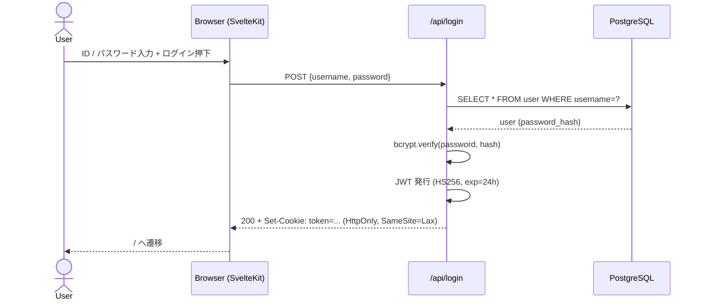
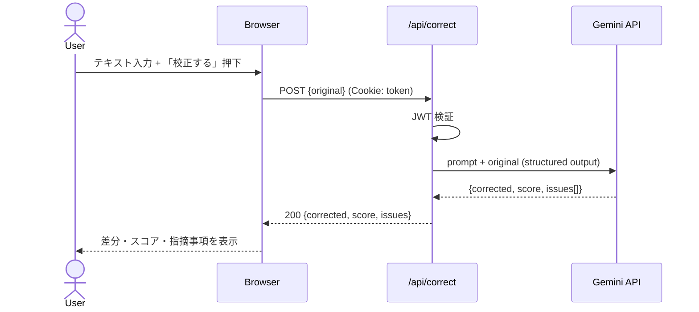
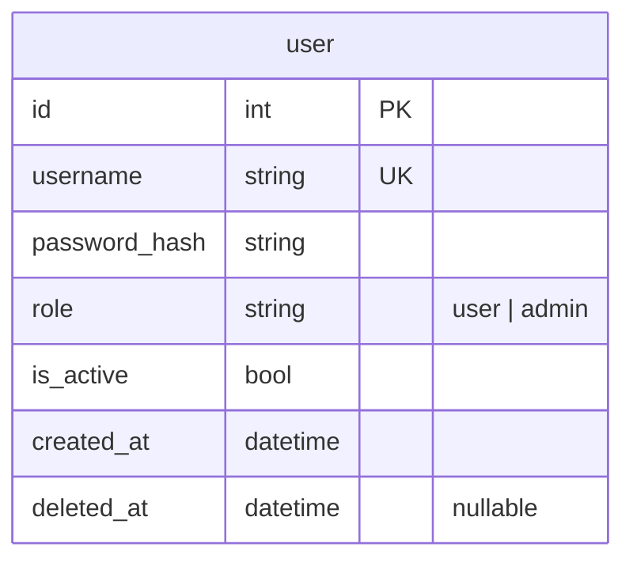

# タイトル：Docs誤字チェックAIの作成

### 概要・目的

ユーザーがメールを送る際に誤字チェックを行うのが面倒くさい。
誤字だけではなく、適切な敬語を使えているのかも不安。

AIを用いてこれらのチェックを効率化することが目的。

### 機能要件

- ID/passでのログイン
- ログアウト
- ユーザーがテキストをアップロードできる
- AIが校正して返す
- AIによるスコアが確認できる

### 非機能要件

- なるべく安く
- 精度も考慮
- 人はそんなに使わない。

### 画面構成

`/login`

- Input × 2（ID, パスワード）
- Button（ログイン）

```
<script lang="ts">
 import LoginForm from "$lib/components/login-form.svelte";
</script>
<div class="flex h-screen w-full items-center justify-center px-4">
 <LoginForm />
</div>
```

```
<script lang="ts">
  import { Button } from "$lib/components/ui/button/index.js";
  import * as Card from "$lib/components/ui/card/index.js";
  import { Input } from "$lib/components/ui/input/index.js";
  import {
    FieldGroup,
    Field,
    FieldLabel,
    FieldDescription,
  } from "$lib/components/ui/field/index.js";
  const id = $props.id();
</script>
<Card.Root class="mx-auto w-full max-w-sm">
  <Card.Header>
    <Card.Title class="text-2xl">Login</Card.Title>
    <Card.Description>Enter your email below to login to your account</Card.Description>
  </Card.Header>
  <Card.Content>
    <form>
      <FieldGroup>
        <Field>
          <FieldLabel for="email-{id}">Email</FieldLabel>
          <Input id="email-{id}" type="email" placeholder="m@example.com" required />
        </Field>
        <Field>
          <div class="flex items-center">
            <FieldLabel for="password-{id}">Password</FieldLabel>
            <a href="##" class="ms-auto inline-block text-sm underline">
              Forgot your password?
            </a>
          </div>
          <Input id="password-{id}" type="password" required />
        </Field>
        <Field>
          <Button type="submit" class="w-full">Login</Button>
          <Button variant="outline" class="w-full">
            <svg xmlns="http://www.w3.org/2000/svg" viewBox="0 0 24 24">
              <path
                d="M12.48 10.92v3.28h7.84c-.24 1.84-.853 3.187-1.787 4.133-1.147 1.147-2.933 2.4-6.053 2.4-4.827 0-8.6-3.893-8.6-8.72s3.773-8.72 8.6-8.72c2.6 0 4.507 1.027 5.907 2.347l2.307-2.307C18.747 1.44 16.133 0 12.48 0 5.867 0 .307 5.387.307 12s5.56 12 12.173 12c3.573 0 6.267-1.173 8.373-3.36 2.16-2.16 2.84-5.213 2.84-7.667 0-.76-.053-1.467-.173-2.053H12.48z"
                fill="currentColor"
              />
            </svg>
            Login with Google
          </Button>
          <FieldDescription class="text-center">
            Don't have an account? <a href="##">Sign up</a>
          </FieldDescription>
        </Field>
      </FieldGroup>
    </form>
  </Card.Content>
</Card.Root>
```

`/`（校正画面）

- ログアウトボタン（右上 / layout）
- Textarea（テキスト入力）
- Button（校正する）
- ローディング表示（校正中）
- エラー表示（API 失敗時）
- ──校正後に下に表示──
  - スコア（例：80点）
  - 差分表示（DiffView.svelte）
  - 指摘事項リスト（issues）

`/admin`（admin role のみ）

- ユーザー登録フォーム（username / password / Button）
- ユーザー一覧 + 各行に「無効化」ボタン

判断材料：校正結果は永続化しないため、`/result/{id}` のような別画面は作れない（id が無い）。同画面の textarea の下に表示する。

### ユーザーフロー

ユーザー：ID/passでログイン

ユーザー：textを入力し、「誤字check」ボタンをクリック

UI：指摘事項が表示され、点数が表示される

### データフロー

1. id passでログイン
2. ユーザーがテキストを入力して「校正する」をクリック
3. 校正API（POST）が呼ばれる
4. サーバーは Gemini API を呼ぶ
5. 結果をフロントに返す（校正結果は永続化しない）

#### シーケンス図 1: ログイン



#### シーケンス図 2: 校正



### DB設計

校正結果は永続化しないので、DB は `user` テーブルのみ。

【user】

- id int PK
- username str UNIQUE
- password_hash str
- role str #user|admin
- is_active bool
- created_at datetime
- deleted_at datetime

#### ER図



ソフトデリート方針：

- `user` を無効化する場合は `deleted_at` を立てる（物理削除しない）
- 取得系クエリは常に `WHERE deleted_at IS NULL` で絞る
  - 絞らないと「無効化したはずのユーザー」がログイン可能になってしまう

### model選定

採用: **`gemini-2.5-flash-lite`**（校正用）

- 料金（Standard）: Input $0.10 / Output $0.40 per 1M tokens
- 1リクエスト ≒ 0.14円（入力1.5k / 出力2k トークン想定）
- 非機能要件「なるべく安く」「人はそんなに使わない」と整合
- 短文の誤字・敬語チェックなら精度面でも実用に達する判定

参考: <https://ai.google.dev/gemini-api/docs/pricing>
参考: <https://artificialanalysis.ai/models>

将来 `flash` / `pro` への切り替えを許容するため、モデル名は環境変数 `GEMINI_MODEL` で差し替え可能にしておく。

### 認証

セッション認証はサーバー側で状態を管理する。ログイン時にサーバーが整理券を発行して、DBに保存する。

```
[ログイン]
  ユーザー: ID/pass を送る
  サーバー: 検証OK → ランダムな文字列「abc123」生成
            DB の sessions テーブルに保存:
              { session_id: "abc123", user_id: 1, expires: ... }
            Cookie に「abc123」をセット

[次のリクエスト]
  ユーザー: Cookie の「abc123」を送る
  サーバー: DB を SELECT → user_id=1 と判明 → 処理

```

JWTはクライアント側で状態を管理する。

```
[ログイン]
  ユーザー: ID/pass を送る
  サーバー: 検証OK → 名札を作る:
    { user_id: 1, exp: 2026-04-29 }  ← ここに情報が直接入ってる
    + サーバーの秘密鍵で署名
    → 「eyJhbGc...」みたいな長い文字列
  Cookie にセット

[次のリクエスト]
  ユーザー: Cookie の名札を送る
  サーバー: 署名を検証（秘密鍵で）→ 改ざんされてなければ user_id=1 と分かる
            ★DB は引かない★

```

でもJWTのメリットとして、DBを叩かないので、スケールした時にDB負荷がかかりやすい構造にはならない。

#### 用語整理：JWT / Cookie / JWT_SECRET

混同しやすい3つの違い：

|                | 何？                             | どこに居る？                  | 何個ある？                          |
| -------------- | -------------------------------- | ----------------------------- | ----------------------------------- |
| **JWT_SECRET** | サーバーの秘密の鍵（実印）       | サーバーだけ（環境変数）      | サーバーに**1個**（全ユーザー共通） |
| **JWT**        | ユーザーの名札（payload + 署名） | ブラウザの Cookie の中        | ログイン中のユーザーごとに1個       |
| **Cookie**     | JWT を運ぶ入れ物                 | ブラウザ ⇄ サーバー間を行き来 | ブラウザが自動で管理                |

関係：

```
[サーバー]                          [ブラウザ]
  JWT_SECRET（秘密）

  ① JWT_SECRET で署名
     ↓
  JWT 作成 ─────Set-Cookie────→ Cookie に保存
                                       │
                                       ↓
  ③ JWT_SECRET で検証              ② 毎回 Cookie 送る
     ↑                                 │
  JWT 受信 ←────Cookie送信──────────────┘
```

**重要な性質**：

- JWT_SECRET が漏れる = 全ユーザー陥落（攻撃者が誰のトークンでも偽造できる）
- 個人の JWT が漏れる = その人だけ被害
- HttpOnly Cookie だと JS から JWT を読めないので XSS で盗まれにくい

#### 採用する設定

- **JWT** + **HttpOnly Cookie**（HS256, exp=24h, SameSite=Lax）
- **HttpOnly**：JS から token を読めない → XSS 対策
- **SameSite=Lax**：他サイトからの POST に Cookie を付けない → CSRF 対策
  - Strict にしないのは、外部リンク経由でログイン状態が切れる UX 劣化を避けるため
  - 参考：<https://qiita.com/flyaway/items/d30c99a662330df0c00d>
- **ログアウト**：Cookie 削除のみ（`Set-Cookie: token=; Max-Age=0`）
  - 発行済み JWT は exp(24h) まで有効。社内15人・低リスクのため許容
- **パスワード**：bcrypt でハッシュ化して `user.password_hash` に保存

#### なぜ JWT を選んだか（限界の自覚つき）

- JWT のスケール優位性は今回（15人）では効かない
- ログアウトの即時無効化もできない（DB引かない設計だから）
- それでも採用：シンプルさと学習目的。本格運用ならセッション方式 or refresh token を検討

### ユーザー管理・権限

- user：一般ユーザー（文章校正のみ）
- admin：管理者（userができることに加え、ユーザーの登録と消去）

### API

- POST /api/admin/user ユーザー登録（※adminのみ）
  - リクエスト：
    ```
    {
      "username": "taro",
      "password": "taro1234"
    }
    ```
  - レスポンス：
    ```
    {
      "id": 1,
      "username": "taro"
    }
    ```

- PATCH /api/admin/user/{id}/deactivate ユーザーの無効化
  - リクエスト：なし
  - レスポンス：
    ```
    {
      "id": 1,
      "username": "taro",
      "is_active": false
    }
    ```

  ソフトデリート
  - 「間違えて消した」を戻せる
  - 「退会したユーザーが過去何人いたか」わかる

- POST /api/login ログイン
  - リクエスト：
    ```
    {
      "username": "taro",
      "password": "taro1234"
    }
    ```
  - レスポンス：
    ```
    {
      "username": "taro",
      "role": "user"
    }
    ```

- POST /api/logout ログアウト
  - リクエスト：なし
  - レスポンス：Set-Cookie: token=; Max-Age=0 で Cookie を削除
  - 注：発行済み JWT は exp(24h) まで有効。社内15人・低リスクのため許容。

- POST /api/correct 校正する
  - リクエスト：
    ```
    {
      "original": "検証したい文章"
    }
    ```
  - レスポンス：
    ```
    {
      "corrected": "検証した文章",
      "score": 80,
      "issues": [...]
    }
    ```

### 初期セットアップ

- サーバー起動時にadminユーザーを自動作成
- 環境変数で初期adminのID/passを渡す。

### 環境変数

```
# AI

GOOGLE_API_KEY=...   # langchain-google-genai が自動で読む
GEMINI_MODEL=gemini-2.5-flash-lite

# DB

DATABASE_URL=postgresql+asyncpg://...

# 認証

JWT_SECRET=...

# 初期セットアップ

INITIAL_ADMIN_USERNAME=admin
INITIAL_ADMIN_PASSWORD=...

```

### ディレクトリ構成

以下の構成を参考に下に構成図を作成してください。

```
docs-checker/
├── backend/
│ ├── api/
│ │ ├── main.py           # FastAPI 本体・エンドポイント定義
│ │ ├── auth.py           # 認証（bcrypt / JWT / Depends）
│ │ ├── config.py         # pydantic-settings で env 読み込み
│ │ ├── db.py             # async engine + SessionLocal + get_session
│ │ ├── models.py         # DB テーブル定義（User）
│ │ ├── initial_admin.py  # 起動時の冪等な admin 作成
│ │ └── ai.py             # Gemini 呼び出し（phase 3 で追加）
│ ├── prompts/
│ │ └── correct.yaml      # 校正プロンプト
│ ├── docker/
│ │ └── compose.yml       # PostgreSQL
│ ├── tests/              # pytest（auth/initial_admin/smoke）
│ ├── .env
│ ├── .env.example
│ └── pyproject.toml
│
├── frontend/
│ ├── src/
│ │ ├── app.html
│ │ ├── app.css
│ │ ├── routes/
│ │ │ ├── +layout.svelte # 共通の枠
│ │ │ ├── +layout.ts # SSRオフ
│ │ │ ├── +page.svelte # / 校正画面
│ │ │ ├── login/
│ │ │ │ └── +page.svelte # /login
│ │ │ └── admin/
│ │ │ └── +page.svelte # /admin
│ │ └── lib/
│ │ ├── components/
│ │ │ ├── DiffView.svelte # 自作: 差分表示
│ │ │ └── ui/ # shadcn
│ │ │ ├── button/
│ │ │ ├── card/
│ │ │ ├── input/
│ │ │ ├── table/
│ │ │ └── textarea/
│ │ ├── api/
│ │ │ └── fetch.ts # APIを叩く関数
│ │ └── stores/
│ │ └── auth.svelte.ts # ログイン状態
│ ├── svelte.config.js
│ ├── vite.config.ts
│ └── package.json
│
└── README.md
```

### 作成ステップ

以下は構成例です。

※今回のPJに対応できるように上書きしてください。

Step 1: プロジェクト初期化（5分）

- フォルダ構成作る
- uvでbackend init、bunでfrontend init
- Docker compose（PostgreSQL）

Step 2: DB + 認証（10分）

- config.py（pydantic-settings）
- models.py（User）
- db.py（async engine + session）
- auth.py + login/logout API
- initial_admin.py（起動時 admin 自動作成）
- 動作確認（curl でログインできるか）

Step 3: 校正API（10分）

- Gemini API + LangChain + yaml
- POST /api/correct
- 動作確認（Swaggerで校正できるか）

Step 4: フロント（15分）

- SvelteKit + Tailwind + shadcn
- /login画面
- /画面（入力→校正→結果表示）
- 動作確認（ブラウザで全部動くか）

Step 5: 管理者機能（5分）

- admin API
- /admin画面

Step 6: 余った時間

- テスト、エラーハンドリング、UI調整

### 確認観点

実装が返ってきたら必ず確認:

- memo.md の設計通りになってるか
- 環境変数をハードコードしてないか
- エラーハンドリングが入ってるか
- 自分で理解できるコードか（説明できないコードは危険）

### 重要事項

- developブランチからブランチを切ること。
- 各stepごとにcommitを行うこと。
- Stepごとに実装したら、何をどう作ったか docsに記録すること。/Users/kinhyonu/2wins/docs-checker/docs/smaple.pdfを参考にすること。
- 各ステップごとに必ずテストをしてからcommitすること。
- pytestを取り入れること。
- uv lock --upgradeで定期的にversionは細心なものにすること。これで実行がバグるならそこで衝突しているもののversionを下げる

### memo

GitHubにリポジトリ作成 + origin登録 + push まで一発

gh repo create 99_first_test --private --source=. --push
--source=. で「今いるディレクトリ」を、--push で「現在のブランチを一緒にpush」してくれる。--private は公開/非公開の選択（公開したければ --public）。

CSRの確認の方法

pydanticと非同期処理について

---

#### 設計判断のメモ（試験官の追撃に備える材料）

**非機能要件は数値化する**

- 「なるべく安く」「人はそんなに使わない」は判断材料にならない
- 「月1万円」「15人」のように数値化して初めて、選定の根拠が検算できる
- 例：1万円 ÷ 1リクエスト0.14円 = 71,428回/月 → flash-lite ならコストはほぼ無制約

**model選定の落とし穴**

- 「安いから flash-lite」は弱い理由（予算余ってるから）
- 強い理由は「タスクの軽さに対するモデルの妥当性」「過剰精度の回避」
- ただし日本語敬語タスクの公開ベンチマークは無い → 本来は自前評価セットで比較すべき
- リスクヘッジとして `GEMINI_MODEL` 環境変数で切り替え可能にする
- Preview 版（3.x など）は本番採用しない、GA 優先

**JWT を選ぶときの注意**

- 小規模サービス（〜数百人）では JWT のスケール優位性は効かない
- ログアウトの即時無効化が構造的にできない（exp まで生きる）
- refresh token を実装すると DB 参照が発生し JWT の利点が消える
- 「シンプルさ・学習目的」が正直な選定理由になることを認める

**SameSite の使い分け**

- None：常に送る（CSRF 防げない）
- Lax：他サイトからの POST には送らない、GET 通常遷移は送る（バランス型）
- Strict：一切送らない（UX 劣化あり）

**ソフトデリート vs 物理削除**

- 物理削除：DB から消える、戻せない
- ソフトデリート：`deleted_at` を立てて残す、誤削除リカバリ可能
- 全 SELECT に `WHERE deleted_at IS NULL` が必要（ORM で自動付与推奨）

**初期セットアップは冪等に**

- 「無ければ作る、有れば何もしない」（idempotent）
- サーバーは何度でも起動するので、起動のたびに重複エラーにしない

**ドキュメント整合性チェック**

- 機能要件 ↔ 画面構成 ↔ ユーザーフロー ↔ シーケンス図 ↔ API ↔ DB
- どこかに出てくる要素は他にも出ている必要がある
- 試験官は「DBに保存してるのに API で返してないですよね？」みたいな突き方をしてくる

**「自分の手法を説明できる」の本質**

- 選定が正しいことより、選定の限界を理解していることが評価される
- 「メリットは効かないが、シンプルさのために採用」と言える方が強い
- LLM が出した設計を鵜呑みにせず、自分でツッコめるかどうか

**SvelteKit：`+page.svelte` と Component の違い**

- `+page.svelte` は SvelteKit の特殊ファイル（`+` 接頭辞）。`src/routes/` 配下に置くとそのフォルダ名が URL になる
- 普通の `.svelte`（Component）は `src/lib/components/` 配下に置く再利用可能な部品
- ページは薄く保ち、UI は Component に切り出す（テスト・再利用しやすい）
- 他の `+` ファイル：`+page.ts`（load関数）、`+layout.svelte`（共通枠）、`+server.ts`（API）、`+error.svelte`（エラー表示）

**shadcn-svelte の使い方**

- 公式：<https://shadcn-svelte.com>
- Components（単機能：Button等）と Blocks（ページ丸ごと：login-01等）の2種類
- 試験本番では CLI で一括追加が現実的：
  ```bash
  bunx shadcn-svelte@latest init     # プロジェクトに1回だけ
  bunx shadcn-svelte@latest add login-01 button textarea card
  ```
- 学習時は Manual コピーで中身を読むと理解が深まる
- ※必ず SvelteKit プロジェクトの中で実行する（`docs-checker` のような設計だけのリポでは動かない）
